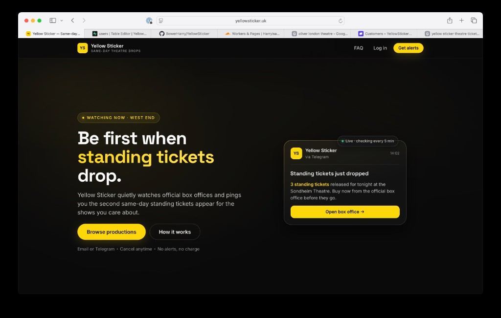
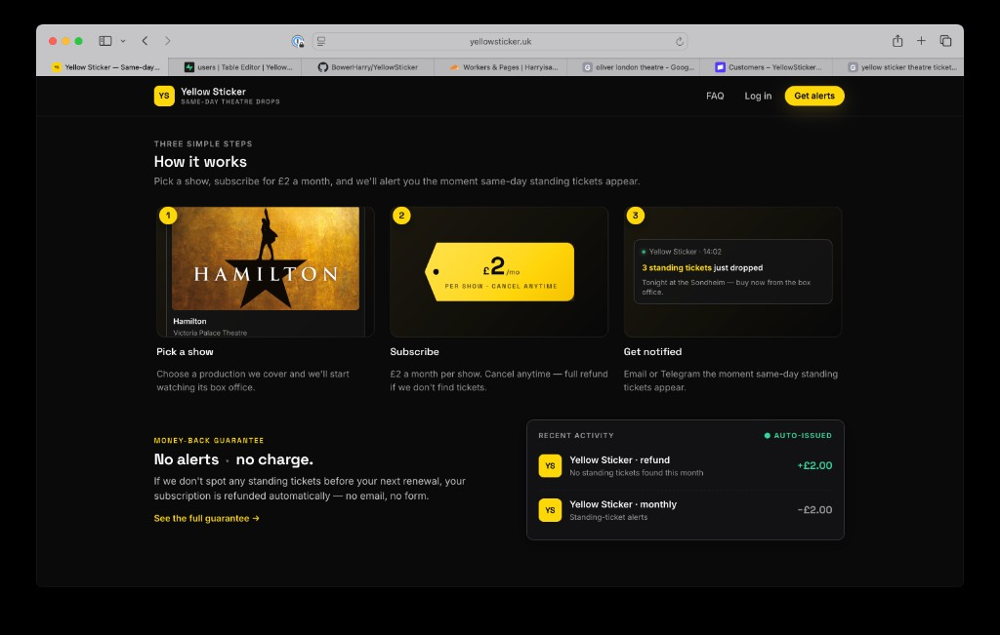
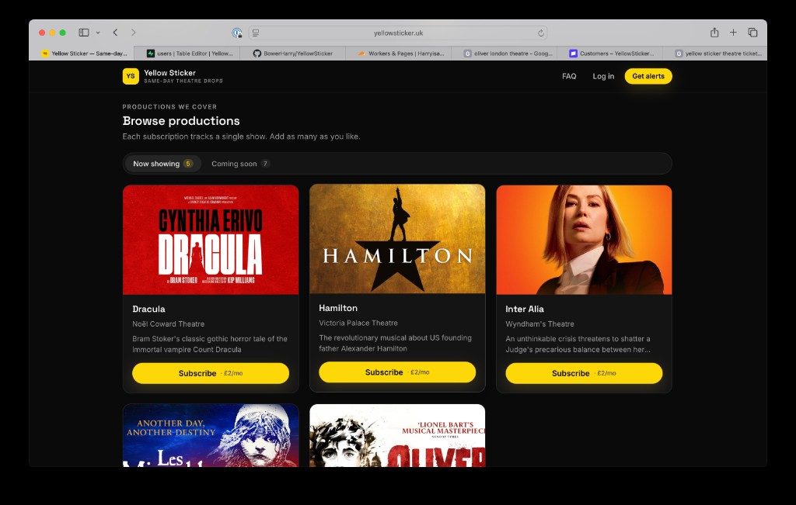
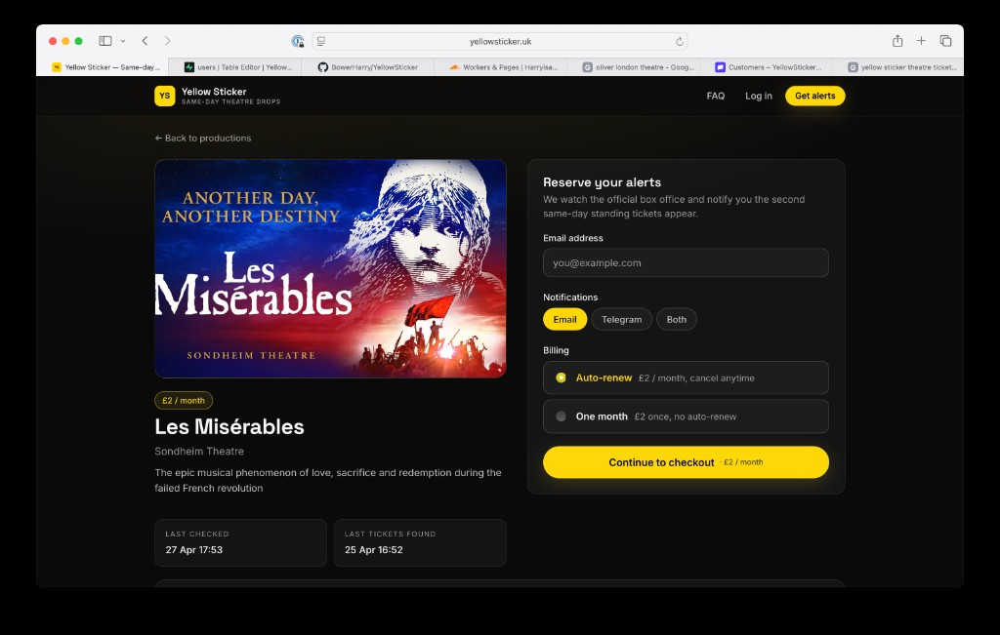
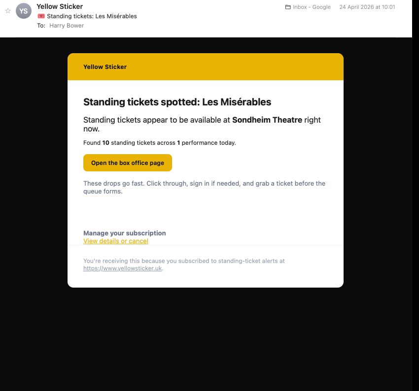

# Yellow Sticker

**[yellowsticker.uk](https://yellowsticker.uk)** · same-day standing-ticket alerts for **London West End** theatre. Subscribers are notified by **email** or **Telegram** when official box-office pages show standing availability — you always buy from the venue, at normal public prices.

> **Status:** Live in production · [yellowsticker.uk](https://yellowsticker.uk)  
> **Stack (at a glance):** hosted React site · Supabase (Postgres + Edge Functions) · Stripe subscriptions · Resend email · Telegram Bot API · Firefox extension scraper · Cloudflare Pages.

---

## The problem

Some London theatres release **cheap same-day standing tickets** when a performance is sold out or nearly sold out. Demand is unpredictable: drops appear briefly and disappear fast.

There is **no stable public API** that tells you *when* those seats go live. Without automation, you’re stuck **refreshing official booking sites by hand** — tedious and easy to miss.

Building reliable automation is **non-trivial**: venues sit behind **cookies, TLS, bot checks**, and **session-dependent APIs**. A naive datacenter scraper often fails or gets blocked.

This project exists to **solve that**: continuously monitor official availability and **alert subscribers immediately**. It started largely **for personal use** — I wanted to know the moment standing inventory appeared — and grew into a **production subscription product**.

---

## What we shipped

| Layer | What it does |
|--------|----------------|
| **Marketing site** | React + TypeScript + Vite SPA — browse productions, subscribe, FAQs, guarantee story |
| **Hosting** | Static deploy on **Cloudflare Pages** with HTTPS |
| **Backend** | **Supabase**: Postgres (users, productions, subscriptions), Row Level Security where applicable, **Deno Edge Functions** for checkout, webhooks, scraping ingest, operator tooling |
| **Payments** | **Stripe** Checkout + Billing webhooks — £2/month per production (or one-off month), cancellations/refunds aligned with guarantee logic |
| **Email** | **Resend** — signup/receipt/lifecycle mail plus standing-ticket availability alerts |
| **Messaging** | **Telegram** bot — optional alerts + account linking via deep links |
| **Availability checks** | **Firefox extension** running on a **home machine**, using a **real browser session** (cookies, challenges) against vendor APIs — posts heartbeats + scrape results to Edge Functions |

Together this is an **end-to-end subscription SaaS**: landing → pay → notify → optional Telegram → automated refunds policy — driven by **honest browser-backed scraping**, not a brittle headless cluster.

---

## Screenshots

  <strong>Home — hero</strong> 
  

  <strong>Home — how it works & guarantee</strong> 
  

  <strong>Browse productions</strong> 
  

  <strong>Production detail — subscribe</strong> 
  

  <strong>Standing-ticket alert email (Resend)</strong> 
  

---

## Repository layout

| Path | Role |
|------|------|
| [`web/`](web/) | Customer-facing SPA (`npm install`, `npm run dev`) |
| [`supabase/`](supabase/) | SQL migrations, Edge Functions, config |
| [`firefox-extension/`](firefox-extension/) | WebExtension scraper — see [`firefox-extension/README.md`](firefox-extension/README.md) |
| [`docs/`](docs/) | Architecture, Stripe modes, secrets, testing |

---

## Documentation (technical — maintainers)

Written for **future-you** (and anyone operating the stack): env vars, deploy steps, Stripe test/live, scraper secrets.

| Doc | Contents |
|-----|----------|
| [`docs/ARCHITECTURE.md`](docs/ARCHITECTURE.md) | End-to-end data flow: web ↔ Stripe ↔ Supabase ↔ extension ↔ ticketing APIs |
| [`docs/DEVELOPMENT.md`](docs/DEVELOPMENT.md) | Local Supabase, deploy functions, web env setup |
| [`docs/SECRETS.md`](docs/SECRETS.md) | Keys & naming (`publishable` vs secret), rotation hygiene |
| [`docs/STRIPE.md`](docs/STRIPE.md) | Webhooks, going live |
| [`docs/STRIPE_MODES.md`](docs/STRIPE_MODES.md) | Test vs live Stripe rows in the database |
| [`docs/DATABASE.md`](docs/DATABASE.md) | Table overview |
| [`docs/TESTING.md`](docs/TESTING.md) | Monitor dashboard, fixtures, manual checks |
| [`docs/env.sample`](docs/env.sample) | Environment variable template (no secrets) |

**Getting started:** clone → [`docs/DEVELOPMENT.md`](docs/DEVELOPMENT.md) → extension [`firefox-extension/README.md`](firefox-extension/README.md).

**Security:** never commit Supabase **secret** keys, Stripe **secret** keys, or webhook signing secrets. Browser/extension only use **publishable** keys — see [`docs/SECRETS.md`](docs/SECRETS.md).
